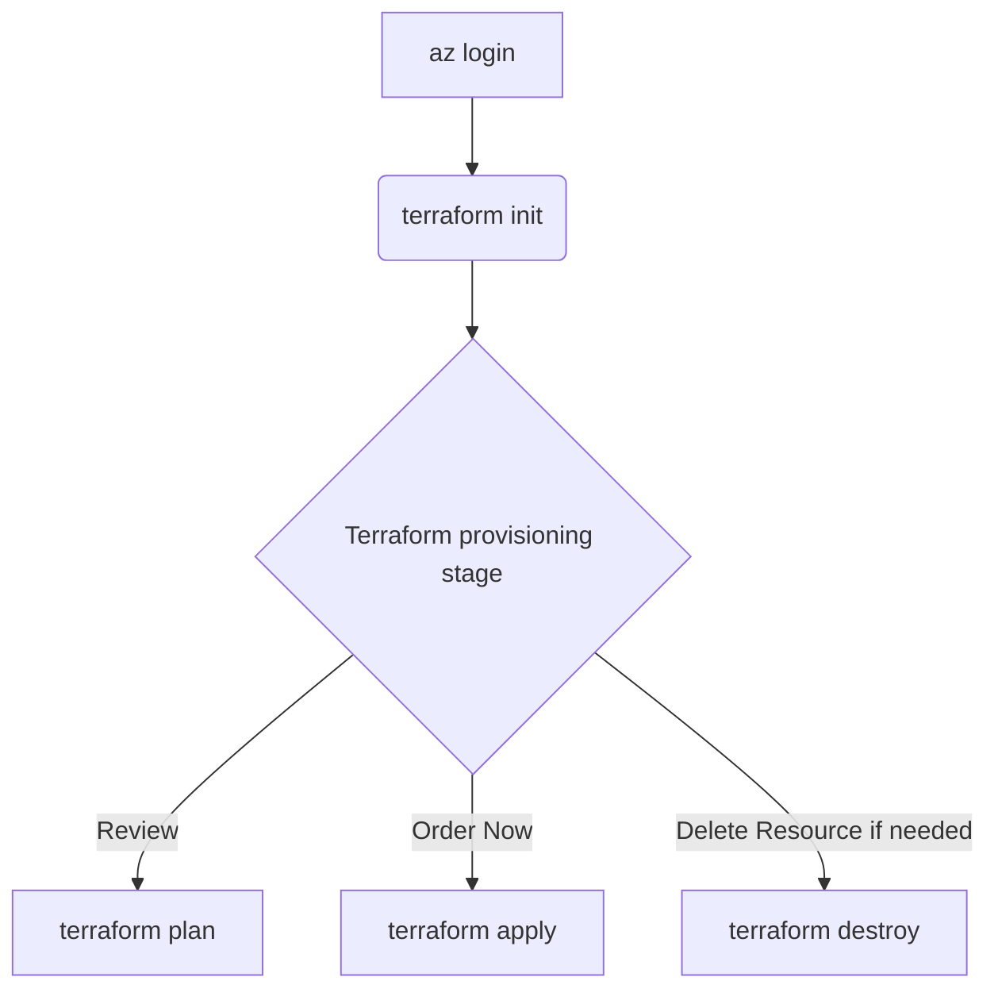

# Azure Infrastructure Terraform Templates

> This approach focuses on `setting up the required infrastructure via Terraform`. It allows for source control of not only the solution code, connections, and setups `but also the infrastructure itself`.

> When `Container App approach`:


> When `Web App approach`:

<div align="center">
  
</div>

<div align="center">
  
</div>

## Prerequisites

- An `Azure subscription is required`. All other resources, including instructions for creating a Resource Group, are provided in this workshop.
- `Contributor role assigned or any custom role that allows`: access to manage all resources, and the ability to deploy resources within subscription.
- Please ensure that:
  - [Terraform is installed on your local machine](https://developer.hashicorp.com/terraform/tutorials/azure-get-started/install-cli#install-terraform).
  - [Install the Azure CLI](https://learn.microsoft.com/en-us/cli/azure/install-azure-cli) to work with both Terraform and Azure commands.

### Azure Resource Providers to Register

Before running `terraform apply`, go to:

1. Azure Portal -> Subscriptions -> *your subscription*
2. Settings -> Resource providers
3. Search each provider below and click **Register** if the status is not already **Registered**

| Resource provider namespace | Required for this IaC | Notes |
|---|---|---|
| `Microsoft.Resources` | Yes | Resource group operations |
| `Microsoft.Authorization` | Yes | Role assignments and custom role definition |
| `Microsoft.Storage` | Yes | Storage account and data pipeline storage usage |
| `Microsoft.CognitiveServices` | Yes | Azure AI Foundry account, project, and connections |
| `Microsoft.DocumentDB` | Yes | Azure Cosmos DB account, SQL DB/container, SQL role assignments |
| `Microsoft.Search` | Yes | Azure AI Search service and indexes |
| `Microsoft.KeyVault` | Yes | Key Vault for app secrets |
| `Microsoft.ContainerRegistry` | Yes | Azure Container Registry |
| `Microsoft.ManagedIdentity` | Yes | User-assigned managed identity |
| `Microsoft.App` | Yes | Azure Container Apps environment and app |
| `Microsoft.Web` | Yes | App Service Plan and Linux Web App deployment target |
| `Microsoft.OperationalInsights` | Yes | Log Analytics workspace |
| `Microsoft.Insights` | Yes | Application Insights, autoscale, alerts, and action groups |
| `Microsoft.Portal` | Yes | Portal dashboard resource |
| `Microsoft.Security` | Optional | Required when Defender for Cloud/DevOps connector options are enabled |

!!! tip
    CLI alternative (register all required providers):

    ```sh
    for ns in Microsoft.Resources Microsoft.Authorization Microsoft.Storage Microsoft.CognitiveServices Microsoft.DocumentDB Microsoft.Search Microsoft.KeyVault Microsoft.ContainerRegistry Microsoft.ManagedIdentity Microsoft.App Microsoft.Web Microsoft.OperationalInsights Microsoft.Insights Microsoft.Portal; do
      az provider register --namespace "$ns" --wait
    done

    # Only if you enable Defender options in terraform.tfvars:
    az provider register --namespace Microsoft.Security --wait
    ```

## Overview

Templates structure:

```
.
├── README.md
├────── main.tf
├────── variables.tf
├────── provider.tf
├────── terraform.tfvars
├────── outputs.tf
```

- main.tf `(Main Terraform configuration file)`: This file contains the core infrastructure code. It defines the resources you want to create, such as virtual machines, networks, and storage. It's the primary file where you describe your infrastructure in a declarative manner.
- variables.tf `(Variable definitions)`: This file is used to define variables that can be used throughout your Terraform configuration. By using variables, you can make your configuration more flexible and reusable. For example, you can define variables for resource names, sizes, and other parameters that might change between environments.
- provider.tf `(Provider configurations)`: Providers are plugins that Terraform uses to interact with cloud providers, SaaS providers, and other APIs. This file specifies which providers (e.g., AWS, Azure, Google Cloud) you are using and any necessary configuration for them, such as authentication details.
- terraform.tfvars `(Variable values)`: This file contains the actual values for the variables defined in `variables.tf`. By separating variable definitions and values, you can easily switch between different sets of values for different environments (e.g., development, staging, production) without changing the main configuration files.
- outputs.tf `(Output values)`: This file defines the output values that Terraform should return after applying the configuration. Outputs are useful for displaying information about the resources created, such as IP addresses, resource IDs, and other important details. They can also be used as inputs for other Terraform configurations or scripts.

## Optional: Microsoft Defender for Cloud

This Terraform setup includes an opt-in configuration to enable **Microsoft Defender for Cloud** plans at the subscription scope.

!!! warning "Important"
    Enabling Defender plans can incur additional costs in your Azure subscription.

- To enable, set `enable_defender_for_cloud = true` in `terraform.tfvars` and optionally adjust `defender_for_cloud_plans`.

## How to execute it



!!! warning "Important"
    Please modify `terraform.tfvars` with your information, then run the following flow. If you need more visual guidance, please check the video that illustrates the provisioning steps.

### 1. Sign in to Azure

Open a browser sign-in flow for the Azure account that will deploy the resources.

```sh
cd terraform-infrastructure
az login
```


### 2. Initialize Terraform

Initialize the working directory and download the required provider plugins.

```sh
terraform init
```


### 3. Review the plan

Create an execution plan to review the resources Terraform will create or update using the values in `terraform.tfvars`.

```sh
terraform plan -var-file terraform.tfvars
```


### 4. Apply the configuration

Apply the reviewed configuration. Terraform prompts for confirmation before making changes.

```sh
terraform apply -var-file terraform.tfvars
```


### 5. Remove resources when finished

Destroy the resources managed by this Terraform configuration when the demo environment is no longer needed.

```sh
terraform destroy -var-file terraform.tfvars
```


